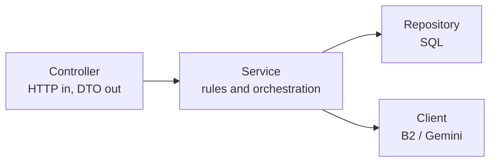
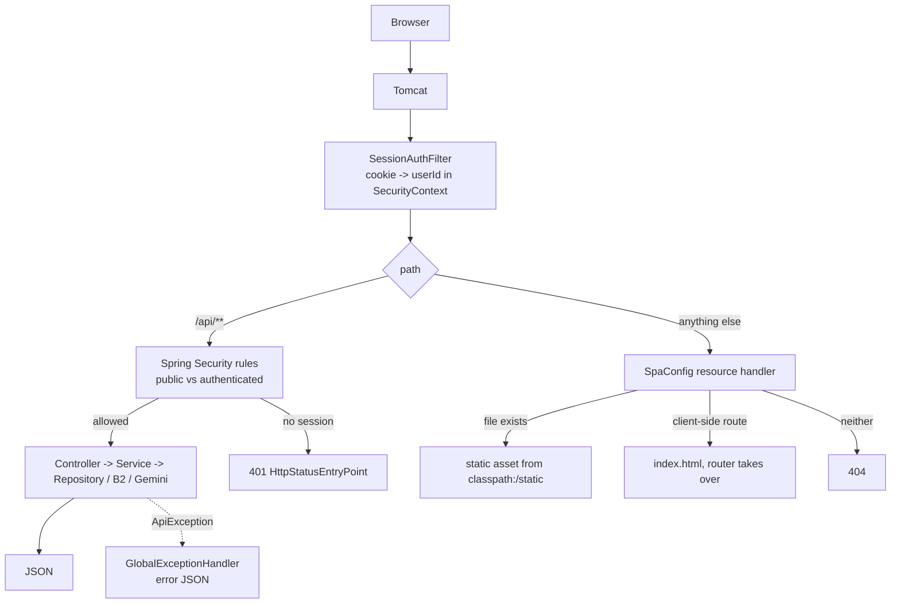
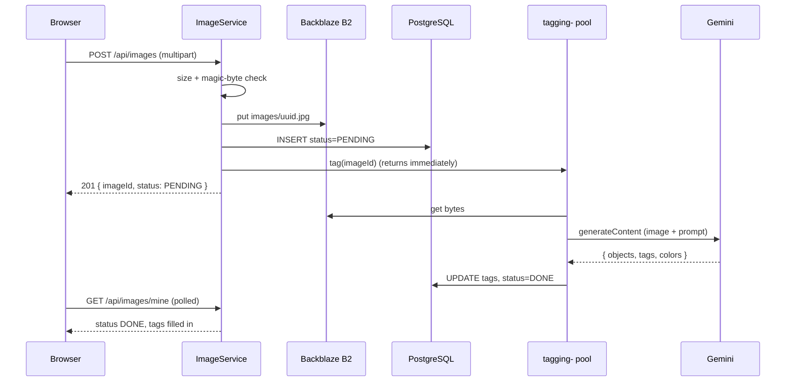

# Architecture

One Spring Boot process serves everything: the React bundle, the JSON API, and
the background thread pool that tags images. Every piece of state lives outside
it — PostgreSQL for metadata, Backblaze B2 for bytes, Gemini for the tags — so
the process itself is disposable and can be restarted or scaled without
migrating anything.

- **Runtime:** Java 25, Spring Boot 4.1, embedded Tomcat
- **Data access:** Spring JDBC (`JdbcClient`) with hand-written SQL — no JPA
- **Schema:** Flyway, applied on startup
- **Entry point:** [`ImageServiceApplication`](../src/main/java/hackyourfuture/net/imageservice/ImageServiceApplication.java)

## The one-process decision

The frontend ships **inside the JAR**, not as a separate static deployment.
That is not a packaging convenience — it is what makes the auth model work.

The session cookie is `SameSite=Strict`, so the browser attaches it only when
the page and the API share an origin. Serving the bundle from Spring keeps that
true in production for free: no CORS configuration, no CSRF token to mint and
validate, no second deploy to keep in step with the first. In development the
Vite dev server proxies `/api` to `:8080` so the same single-origin assumption
holds there too.

The cost is that a frontend change rebuilds and redeploys the backend. For an
app of this size that is a better trade than running two deployments to save a
`npm run build` step. See [frontend.md](frontend.md) for the build wiring and
[auth.md](auth.md) for the cookie itself.

## Package layout

```
hackyourfuture.net.imageservice
├── auth/       registration, login, opaque session ids, SessionAuthFilter
│   ├── controller/   AuthController
│   ├── service/      AuthService, SessionService
│   ├── repository/   UserRepository, SessionRepository
│   ├── security/     SessionAuthFilter
│   ├── model/        User
│   └── dto/          RegisterRequest, LoginRequest, UserResponse
├── image/      upload, listing, search, delete, raw bytes
│   ├── controller/   ImageController
│   ├── service/      ImageService, FileService (B2)
│   ├── repository/   ImageRepository
│   ├── model/        Image, RawImage, Tags
│   └── dto/          ImageResponse, UploadResponse
├── tagging/    the AI side
│   ├── service/      TaggingService (@Async)
│   └── client/       LlmClient (Gemini)
├── config/     SecurityConfig, SpaConfig, AsyncConfig, OpenApiConfig
└── shared/     ApiException, GlobalExceptionHandler
```

Packages are split by **feature first, layer second**. Everything about auth
sits under `auth/`, so a change to how sessions work touches one directory
rather than four parallel `controller/service/repository` trees.

## Layering

Each feature is the same three steps:



The rules the code actually holds to:

- **Controllers never touch the database.** They bind and validate input, call
  one service method, and map the result to a DTO. `ImageController` is about 80
  lines and contains no logic beyond that.
- **Services own the rules** — size limits, ownership checks, what counts as an
  image, when to give up on tagging.
- **Repositories own SQL** and return domain records. `ImageRepository` is also
  the only place that knows tags are stored as `jsonb`.
- **DTOs are records with a `from(...)` factory**, so the wire shape is decided
  in one place. `ImageResponse.from` is what turns an image id into the `url`
  clients use.
- **Errors are thrown, not returned.** Services throw
  [`ApiException`](../src/main/java/hackyourfuture/net/imageservice/shared/ApiException.java)
  with a status and a message;
  [`GlobalExceptionHandler`](../src/main/java/hackyourfuture/net/imageservice/shared/GlobalExceptionHandler.java)
  turns it into `{"error": "..."}`. No method signature carries an error
  channel, and every failure reaches the client in the same shape.

Lombok is on the classpath but the domain types are plain Java records —
immutable, no accessors to generate.

## The path of a request



Two details that matter:

- `SessionAuthFilter` runs on **every** request, including ones that turn out
  to be anonymous. It never rejects anything — it only populates the security
  context when the cookie is valid, and Spring Security's rules decide from
  there. That keeps "who are you" and "are you allowed" in separate places.
- The `/api/**` authorisation rule is declared **before** the catch-all rule
  that opens up static files, so the frontend's permissive matcher can never
  accidentally expose an API route. See
  [`SecurityConfig`](../src/main/java/hackyourfuture/net/imageservice/config/SecurityConfig.java).

## The asynchronous seam

Upload is the only place the app deliberately does not finish its work before
answering:



Tagging is one slow HTTPS call — seconds, not milliseconds — and nothing about
the upload depends on its result. Making the client wait for it would tie a
request thread to an external service's latency and hand the user a spinner for
no reason. So the bytes are stored, a `PENDING` row is committed, the image id
goes to the pool, and the response goes out.

The consequence is that `PENDING` is a real, observable state that clients must
handle. The frontend does it by polling while any image in a listing is still
pending, and stopping once they all settle. Details in
[tagging.md](tagging.md) and [frontend.md](frontend.md).

## Where state lives

| State | Where | Notes |
| --- | --- | --- |
| Users, sessions, image metadata, tags | PostgreSQL | The only durable store the app writes SQL against |
| Image bytes | Backblaze B2, private bucket | Never public; served through `GET /api/images/{id}/raw` |
| Login state | The `sessions` table + an HttpOnly cookie | Server-side, so logout revokes instantly |
| In-flight tagging jobs | The `applicationTaskExecutor` queue | **In memory** — see below |

The tagging queue is the one piece of state that does not survive a restart. If
the process stops with work queued, those images stay `PENDING` forever; there
is no retry sweeper. The mitigation is a 30-second graceful shutdown that lets
in-flight tagging finish, and the fact that a stuck `PENDING` costs nothing but
missing tags — the image itself is stored and served normally. A scheduled
"re-tag anything still PENDING" job is the obvious next step if that ever
matters.

## Design choices worth knowing

- **Spring JDBC over JPA.** Roughly a dozen queries, two of which are
  Postgres-specific (`jsonb` containment, `RETURNING`). An ORM would have added
  a mapping layer to abstract a database this app is not trying to leave.
- **Opaque session ids over JWT.** A JWT cannot be revoked before it expires
  without a server-side denylist — which is a session table with extra steps.
- **Magic-byte validation over `Content-Type`.** The declared type is attacker
  controlled; the first bytes of the file are not. See [images.md](images.md).
- **Storage failures degrade, they do not crash.** Missing B2 credentials leave
  the app bootable with storage calls returning 503, so the frontend, auth and
  Swagger UI all still work. Same idea for a missing Gemini key: uploads
  succeed and images end `FAILED` rather than the app refusing to start.
