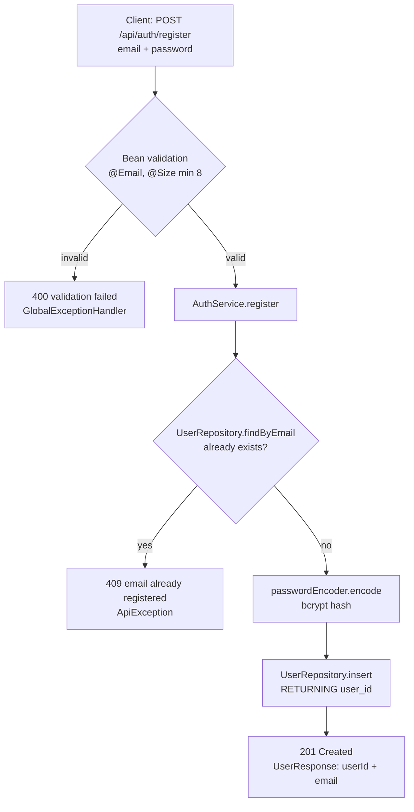
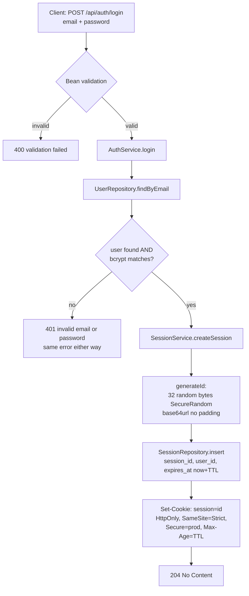
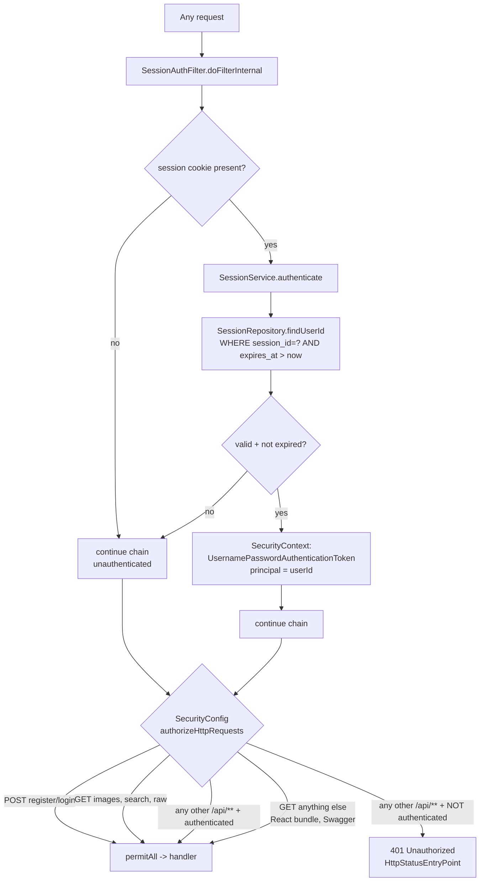
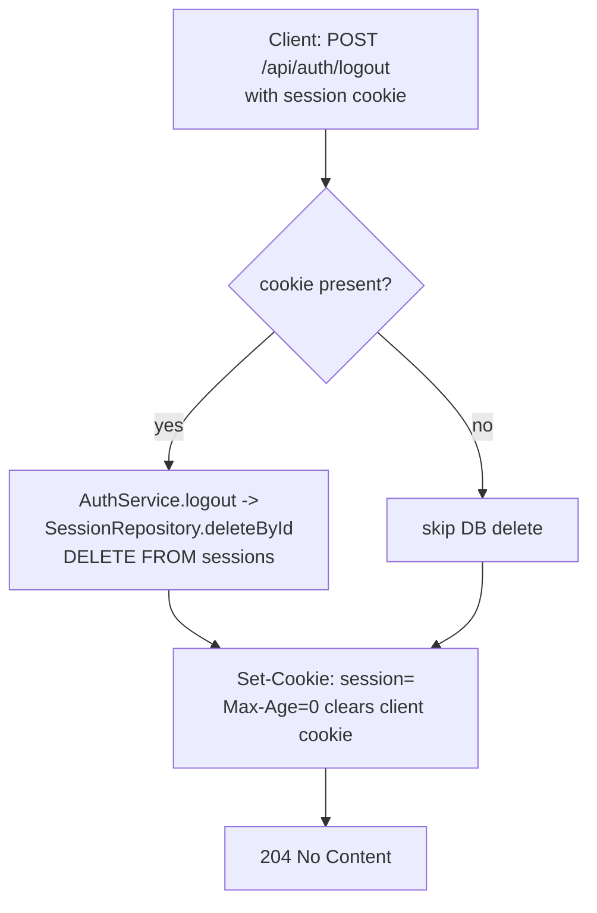
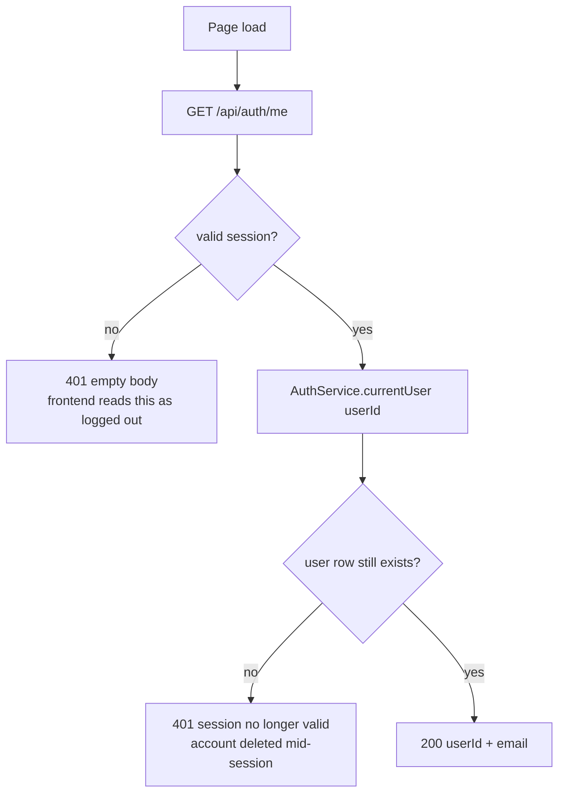

# Authentication

Session-based auth with an **opaque session id** (not JWT), stored server-side in
the `sessions` table with the owning `user_id` and an `expires_at`. Passwords are
hashed with **bcrypt**. The session id travels in an **HttpOnly** cookie.

- **Package:** `auth` (`controller`, `service`, `repository`, `security`, `model`, `dto`)
- **Config:** [`config/SecurityConfig`](../src/main/java/hackyourfuture/net/imageservice/config/SecurityConfig.java) — stateless Spring Security, bcrypt bean
- **Errors:** [`shared/GlobalExceptionHandler`](../src/main/java/hackyourfuture/net/imageservice/shared/GlobalExceptionHandler.java) — consistent `{"error": "..."}` JSON

---

## 1. Registration — `POST /api/auth/register`

Registering does **not** issue a cookie — only login does. The frontend calls
login immediately afterwards so signup feels like one step.

## 2. Login — `POST /api/auth/login`

## 3. Authenticated request — every route via `SessionAuthFilter`

The filter never rejects anything. It only populates the security context when
the cookie is valid, and the authorisation rules decide from there — which keeps
"who are you" and "are you allowed" in separate places.

Order matters in those rules: the `"/api/**" → authenticated` matcher is
declared **before** the permissive `GET /**` matcher that serves the React
bundle, so the static rule can never accidentally open up an API route.

`shouldNotFilterErrorDispatch()` returns `false`, so the filter also runs on
error dispatches. Without it a request for a missing route would lose its
authentication on the way to the error handler and come back `401` instead of
`404`.

## 4. Logout — `POST /api/auth/logout`

Because the session lives server-side, the id is dead the moment this returns —
a client that kept a copy of the cookie gains nothing.

## 5. Who am I? — `GET /api/auth/me`

The cookie is `HttpOnly`, so JavaScript cannot read it. A browser client that
has just loaded a page knows nothing about its own session until it asks:

This endpoint is the entire reason the frontend needs no auth store: the session
is server state like any other, fetched with one query. See
[frontend.md](frontend.md).

---

## Design points

- **Opaque session id, not JWT** — stored server-side in `sessions` with
  `user_id` and `expires_at`, so it can be revoked immediately on logout. A JWT
  cannot be revoked before it expires without a server-side denylist, which is a
  session table with extra steps.
- **bcrypt** via `BCryptPasswordEncoder`; login returns a single generic error
  for both unknown email and wrong password to avoid user enumeration. The same
  care is why registration's `409` is the one place account existence leaks —
  unavoidable if the user is to be told the address is taken.
- **32 bytes from `SecureRandom`**, base64url without padding. 256 bits of
  entropy, not guessable, and URL/cookie-safe without escaping.
- **Cookie hardening** — `HttpOnly` (no JS access, so XSS cannot exfiltrate the
  session), `SameSite=Strict` (CSRF mitigation), `Secure` toggled by
  `app.session.cookie-secure` (false locally over HTTP, true under the `prod`
  profile), `Path=/`, and `Max-Age` equal to the session TTL.
- **`SameSite=Strict` is why the frontend ships in the JAR.** The browser sends
  the cookie only on same-origin requests; serving the bundle from Spring makes
  that true in production, and the Vite proxy makes it true in development. It
  is also why CSRF protection can be disabled without exposure.
- **Stateless Spring Security** — `SessionCreationPolicy.STATELESS`, no
  `JSESSIONID`, no form login, no http-basic.
  `UserDetailsServiceAutoConfiguration` is excluded in
  `ImageServiceApplication`, so Spring's default generated user never exists.
  `SessionAuthFilter` reconstructs authentication from the cookie on every
  request.
- **The principal is the `userId`**, an `Integer`, injected into controllers with
  `@AuthenticationPrincipal`. No `UserDetails`, no extra database round trip per
  request beyond the session lookup itself.
- **Public routes** — `POST /api/auth/register`, `POST /api/auth/login`, the
  three read-only image routes (`GET /api/images`, `GET /api/images/search`,
  `GET /api/images/{id}/raw`), and the static frontend plus Swagger UI.
  Everything else under `/api` requires a valid session. The gallery is public
  by design; uploading, deleting and listing your own images are not.

## Session lifetime

`APP_SESSION_TTL_DAYS` (default 7) drives **both** the `expires_at` stored on
the row and the cookie's `Max-Age`. `AuthController` reads the lifetime from
`SessionService` rather than keeping its own copy — if the two disagreed, the
browser would either keep sending a cookie the server has already expired or
drop one the server still honours.

Changing it affects new logins only; existing sessions keep the expiry they were
created with.

## Data model

- **`users`** — `user_id`, `email` (unique), `password_hash` (bcrypt), `created_at`
- **`sessions`** — `session_id` (PK), `user_id` (FK, `ON DELETE CASCADE`), `expires_at`

The session id is the primary key, so authenticating a request is a single index
probe. `ON DELETE CASCADE` means deleting a user logs them out everywhere.
Full schema in [database.md](database.md).

## Known gaps

Worth naming rather than discovering later:

- **Expired sessions are never deleted.** `findUserId` filters on
  `expires_at > now()`, so a stale row can never authenticate — but the table
  grows until something prunes it. A nightly
  `DELETE FROM sessions WHERE expires_at < now()` is the fix.
- **Email comparison is case-sensitive.** `WHERE email = ?` with no
  normalisation, so `Me@example.com` and `me@example.com` are two accounts.
  Lowercasing on registration and login would close it.
- **No rate limiting on login.** Nothing slows down repeated password attempts.
- **No password reset, email verification, or session listing.** Out of scope
  for this app as built.
- **Sessions are not rotated on login.** Each login creates an additional
  session rather than replacing the previous one, so signing in on a second
  device leaves both valid — intended, but it means there is no "log out
  everywhere" short of deleting the rows.
