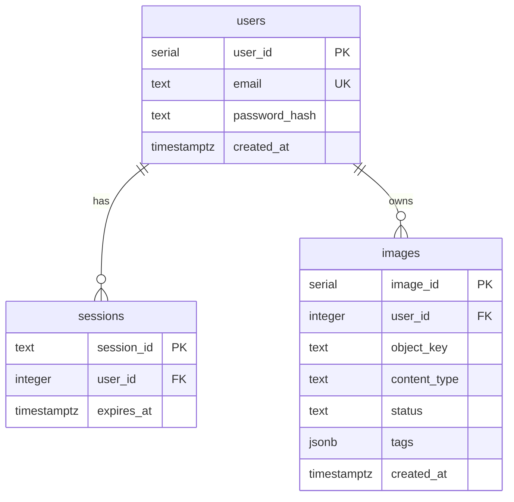

# Database

PostgreSQL, accessed through Spring JDBC's `JdbcClient` with hand-written SQL.
Three tables, three Flyway migrations, no ORM.

- **Migrations:** [`src/main/resources/db/migration/`](../src/main/resources/db/migration/)
- **Repositories:**
  [`UserRepository`](../src/main/java/hackyourfuture/net/imageservice/auth/repository/UserRepository.java),
  [`SessionRepository`](../src/main/java/hackyourfuture/net/imageservice/auth/repository/SessionRepository.java),
  [`ImageRepository`](../src/main/java/hackyourfuture/net/imageservice/image/repository/ImageRepository.java)

## Why no JPA

The app runs about a dozen queries, and two of them are things an ORM would get
in the way of: `jsonb` containment for tag search, and `INSERT … RETURNING` to
get a fully populated row back in one round trip. Adding an entity-mapping layer
to abstract over a database this app has no intention of leaving would buy
nothing and hide the two queries that actually matter.

`JdbcClient` gives parameter binding, a `RowMapper` per table, and SQL that
means exactly what it says.

## Schema



### `users` — [V1](../src/main/resources/db/migration/V1__create_users_table.sql)

```sql
CREATE TABLE users (
    user_id       SERIAL      PRIMARY KEY,
    email         TEXT        NOT NULL UNIQUE,
    password_hash TEXT        NOT NULL,
    created_at    TIMESTAMPTZ NOT NULL DEFAULT now()
);
```

The plaintext password never reaches this table — only a bcrypt hash, which
carries its own salt and cost factor inside the string. `UNIQUE` on `email` is
the real guard against duplicate accounts; the `findByEmail` check in
`AuthService` exists to turn the race into a friendly `409` rather than a
constraint-violation stack trace.

### `sessions` — [V2](../src/main/resources/db/migration/V2__create_sessions_table.sql)

```sql
CREATE TABLE sessions (
    session_id TEXT        PRIMARY KEY,
    user_id    INTEGER     NOT NULL REFERENCES users (user_id) ON DELETE CASCADE,
    expires_at TIMESTAMPTZ NOT NULL
);
```

The session id is 32 random bytes, base64url-encoded — it *is* the primary key,
so every lookup on every authenticated request is a single index probe. Expiry
is stored per row rather than inferred from a creation timestamp, so changing
`APP_SESSION_TTL_DAYS` affects new logins only and never retroactively shortens
or extends a session someone is holding.

`ON DELETE CASCADE` means deleting a user logs them out everywhere, atomically.

Expired rows are filtered by the `expires_at > now()` predicate in
`findUserId`, so a stale session can never authenticate — but nothing deletes
them. The table accumulates dead rows until someone prunes it. At this scale
that is a rounding error; a nightly `DELETE FROM sessions WHERE expires_at <
now()` is the fix when it stops being one.

### `images` — [V3](../src/main/resources/db/migration/V3__create_images_table.sql)

```sql
CREATE TABLE images (
    image_id     SERIAL      PRIMARY KEY,
    user_id      INTEGER     NOT NULL REFERENCES users (user_id) ON DELETE CASCADE,
    object_key   TEXT        NOT NULL,
    content_type TEXT        NOT NULL,
    status       TEXT        NOT NULL DEFAULT 'PENDING'
                 CHECK (status IN ('PENDING', 'DONE', 'FAILED')),
    tags         JSONB       NOT NULL DEFAULT '{}'::jsonb,
    created_at   TIMESTAMPTZ NOT NULL DEFAULT now()
);

CREATE INDEX idx_images_tags    ON images USING gin (tags);
CREATE INDEX idx_images_user_id ON images (user_id);
```

No image bytes — `object_key` points into the B2 bucket and `content_type` is
what the raw endpoint sets on the response. See [images.md](images.md).

The `CHECK` constraint on `status` is the database refusing to hold a state the
application does not define. It is cheap, and it means a typo in a future
`UPDATE` fails loudly instead of creating a fourth status nothing handles.

`tags` is `NOT NULL DEFAULT '{}'`, so parsing code never has to handle a null
column — a freshly inserted row already carries valid JSON. `ImageRepository`
goes one step further and normalises missing arrays to empty lists when reading,
so `Tags` is never partially null in Java either.

Both foreign keys cascade. Deleting a user removes their sessions and image
rows; the B2 objects are *not* cascaded, which is a known gap noted in
[images.md](images.md).

## Tags as `jsonb`

```json
{
  "objects": ["dog", "grass", "ball"],
  "tags": ["outdoors", "playful", "afternoon"],
  "colors": ["green", "brown", "white"]
}
```

The normalised alternative is a `tags` table plus a join table, and it was not
chosen. Tags are written once by the tagging job and always read as a complete
set with their image; nothing ever queries "all images sharing a tag with this
one" or renames a tag globally. A `jsonb` column keeps the three categories in
one place, needs no joins to render a card, and is still indexable — which is
the part that usually makes people reach for normalisation.

Serialisation is Jackson, in `ImageRepository` alone. The `?::jsonb` casts in
the SQL are what let a `String` parameter land in a `jsonb` column.

### How search works

```sql
SELECT … FROM images
WHERE tags @> '{"objects":["sunset"]}'::jsonb
   OR tags @> '{"tags":["sunset"]}'::jsonb
   OR tags @> '{"colors":["sunset"]}'::jsonb
ORDER BY created_at DESC, image_id DESC
LIMIT 50
```

`@>` is Postgres's containment operator: "does the left document contain the
right one". Each probe is built by `arrayContains(category, term)`, which
serialises `Map.of(category, List.of(term))` — so the term is a bound JSON value
throughout and never string-concatenated into SQL.

The GIN index on `tags` is what makes this fast. GIN indexes the individual keys
and values inside the document, so a containment query is an index lookup rather
than a scan over every row's JSON.

**The trade:** containment matches a *whole element*. `sunset` finds an image
tagged `sunset`; `sun` finds nothing. There is no prefix matching, no fuzzy
matching, no stemming. That is why the prompt in [tagging.md](tagging.md) works
so hard to make the model emit short, lowercase, single-word tags — the write
side is where vocabulary consistency is enforced, which lets the read side stay
one indexed operator.

The upgrade path, if partial matching is ever needed, is a `tsvector` column or
`pg_trgm` alongside this index rather than instead of it: exact tag lookup and
fuzzy text search want different structures.

### Ordering

Every listing orders by `created_at DESC, image_id DESC`. The `image_id`
tiebreaker matters because `created_at` defaults to `now()`, which is the
transaction timestamp — two rows created in the same transaction share it
exactly, and without the tiebreaker their relative order could differ between
two identical requests.

## Migrations

Flyway runs on startup, against every environment including Testcontainers, so
the schema is identical everywhere and there is no manual step between deploying
code and having the tables it expects.

| File | Contents |
| --- | --- |
| `V1__create_users_table.sql` | `users` |
| `V2__create_sessions_table.sql` | `sessions` |
| `V3__create_images_table.sql` | `images` + both indexes |

Rules that come with this: **applied migrations are immutable** — Flyway
checksums them and refuses to start if one changed after being applied. To alter
the schema, add `V4__…`. Never edit `V1`–`V3`.

Local development can bypass that during early experimentation by dropping the
compose volume:

```bash
docker compose down -v && ./mvnw spring-boot:run
```

That destroys all local data and replays every migration from scratch. It is a
development convenience only.

## Connections

| Environment | Database |
| --- | --- |
| Local dev | Postgres 16 from [`compose.yaml`](../compose.yaml), started automatically by `spring-boot-docker-compose` and wired in via `@ServiceConnection` — no datasource config needed |
| Tests | A throwaway `postgres:16-alpine` Testcontainer per test class, also via `@ServiceConnection` |
| Production | Neon (serverless PostgreSQL), through `SPRING_DATASOURCE_URL` / `_USERNAME` / `_PASSWORD` |

The defaults in `application.yaml` (`localhost:5432/imagedb`, `dev`/`dev`) match
`compose.yaml`, so a fresh clone runs with no configuration at all. Environment
variables override them, which is how production points at Neon. See
[configuration.md](configuration.md).
