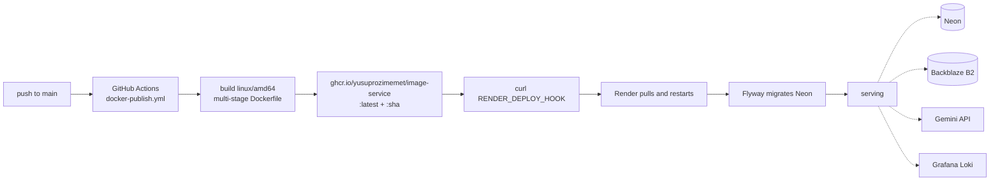

# Deployment

One container runs the whole application — UI, API and tagging pool in the same
process — with every stateful dependency managed elsewhere.

**Live:** <https://image-service-latest.onrender.com>

| Piece | Runs on |
| --- | --- |
| The app | Render, from a container image, `SPRING_PROFILES_ACTIVE=prod` |
| Database | Neon (serverless PostgreSQL); Flyway migrates it on startup |
| Image bytes | Backblaze B2, private bucket |
| Tagging | Google Gemini API |
| Logs | Grafana Cloud Loki, shipped by the logback appender |
| Image registry | GitHub Container Registry (`ghcr.io`) |



## The image

The [`Dockerfile`](../Dockerfile) is two stages:

```dockerfile
FROM maven:3.9-eclipse-temurin-25 AS build
WORKDIR /app
COPY . .
RUN mvn package -DskipTests -Dnpm.install.command=ci

FROM eclipse-temurin:25-jre
WORKDIR /app
COPY --from=build /app/target/*.jar app.jar
EXPOSE 8080
CMD ["java", "-jar", "app.jar"]
```

The build stage carries Maven, a JDK and the whole source tree; the runtime
stage carries a JRE and one JAR. That fat JAR already contains the React bundle
under `/static`, so there is nothing else to copy and no web server to configure.

`-Dnpm.install.command=ci` forces a clean, lockfile-exact npm install. The
default (`install`) exists for local builds, where keeping `node_modules` in
place matters more than byte-exact reproducibility. `-DskipTests` is right here
because the tests need Docker-in-Docker for Testcontainers and CI has already
run them.

```bash
docker build -t image-service .
docker run -p 8080:8080 --env-file .env image-service
```

The container has no database. Point `SPRING_DATASOURCE_URL` at one it can
reach.

## CI

### [`ci.yml`](../.github/workflows/ci.yml) — every push and PR to `main`

```yaml
- name: Lint (Checkstyle)
  run: ./mvnw checkstyle:check --batch-mode

- name: Build and test with Maven
  run: ./mvnw clean package --batch-mode -Dnpm.install.command=ci
```

Checkstyle runs **first** on purpose: a style violation fails in seconds instead
of after the slower test suite. The second step builds the frontend, compiles,
and runs the tests — Testcontainers works on GitHub's runners because Docker is
already available there.

### [`docker-publish.yml`](../.github/workflows/docker-publish.yml) — pushes to `main`, or manual

1. Log in to GHCR with the workflow's own `GITHUB_TOKEN` — no personal token to
   rotate.
2. Build and push for **`linux/amd64` only**, because that is what Render runs.
   Building `arm64` as well would roughly double the build for an artifact
   nothing pulls.
3. Tag twice: `:latest` and `:${{ github.sha }}`. The SHA tag is what makes a
   rollback possible — point Render at a specific commit's image.
4. `curl` the `RENDER_DEPLOY_HOOK` secret.

Two details worth knowing if you fork this:

- **The image name is hard-coded lowercase.** GHCR rejects uppercase names, and
  `${{ github.repository }}` preserves the owner's capitalisation.
- **`RENDER_DEPLOY_HOOK` is a job-level `env`**, not read inline in the step's
  `if:`. The `secrets` context is not available in step conditions, so lifting
  it to `env` is what lets the deploy step skip cleanly on a fork with no hook
  configured.

The two workflows are independent: both trigger on a push to `main` and run in
parallel. A publish is not gated on the test job, so a red build can still ship.
Making the publish `needs: build` is the change if that ever bites.

## Render

Render runs the published image rather than building from source. The important
piece:

> **Image-backed Render services do not redeploy on their own when a tag moves.**

Pushing a new `:latest` changes nothing until something asks Render to pull it —
which is exactly what the deploy-hook step does. Without it, every deploy would
be a manual click.

Environment variables set in the Render dashboard:

| Variable | Value |
| --- | --- |
| `SPRING_PROFILES_ACTIVE` | `prod` |
| `SPRING_DATASOURCE_URL` / `_USERNAME` / `_PASSWORD` | The Neon connection |
| `B2_BUCKET`, `B2_ACCESS_KEY`, `B2_SECRET_KEY` | Backblaze credentials |
| `LLM_API_KEY` | Google AI Studio key |
| `LOKI_URL`, `LOKI_USERNAME`, `LOKI_API_TOKEN` | Grafana Cloud |

`PORT` is injected by Render, and `server.port` reads it with a fallback of
8080. Every credential lives here and nowhere in the repository. Full list in
[configuration.md](configuration.md).

On the free tier the container is started on demand, so the first request after
an idle period is slow — that is a cold JVM start, not the app misbehaving.

## What `prod` changes

[`application-prod.yaml`](../src/main/resources/application-prod.yaml) makes
three changes, each required rather than merely nicer:

- `app.session.cookie-secure: true` — production is HTTPS and the session cookie
  must not travel over plain HTTP.
- ECS JSON console output — logs go to a machine, not a terminal.
- `INFO` root level with `org.springframework.web` and `org.apache.catalina` at
  `WARN` — `DEBUG` would ship request noise to Loki at real cost.

The Loki appender in [`logback-spring.xml`](../src/main/resources/logback-spring.xml)
sits inside a `<springProfile name="prod">` block, so dev, tests and CI never
open a connection to Grafana. See [observability.md](observability.md).

## Migrations in production

Flyway runs on startup against Neon, in the same process that is about to serve
traffic. No migration step in the pipeline, no chance of code deploying ahead of
its schema.

The consequence is that a migration failure is a **boot failure**: the container
fails to start, Render keeps the previous instance, and the logs show the Flyway
error. That is the safe direction, but it means migrations must be
backwards-compatible enough for the old container to keep running while the new
one starts.

## Rollback

The `:${{ github.sha }}` tag is the mechanism. Point the Render service at
`ghcr.io/yusuprozimemet/image-service:<previous-sha>` and redeploy.

Schema changes do not roll back with it — Flyway has no `down` migrations here.
An older image must be able to run against the newer schema, which in practice
means additive migrations: add columns and tables, do not drop or rename them in
the same release that stops using them.

## The failure modes

| If this breaks | What users see |
| --- | --- |
| Neon unreachable | Total outage — the app cannot boot or serve |
| B2 unreachable / misconfigured | Uploads and image loads fail (`503`); the rest of the app works |
| Gemini unreachable / no key | Uploads succeed, images end `FAILED`, search finds less |
| Loki unreachable | Nothing user-visible; the appender drops logs |
| Container restart with work queued | Those images stay `PENDING` — the in-memory tagging queue is not durable |

The ordering is deliberate. Only the database is a hard dependency; every other
integration degrades to a smaller app rather than a broken one.
