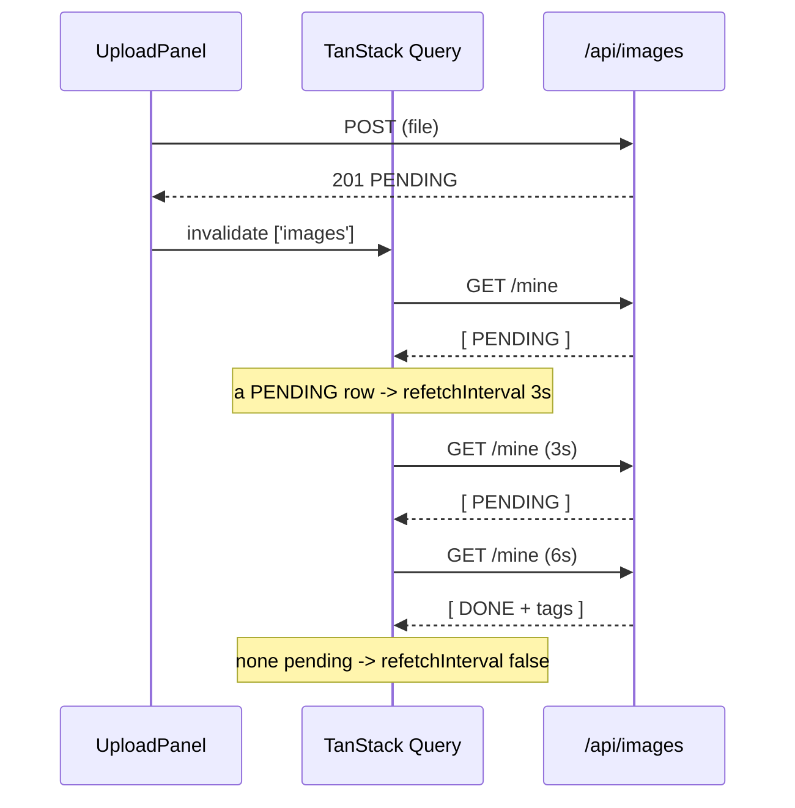

# Frontend

A React 19 + TypeScript single-page app in [`frontend/`](../frontend/), built by
Vite and served by the same Spring Boot process that answers the API. The UI
calls itself **snaptag**.

- **Stack:** React 19, TypeScript, Vite 8, Material UI 9, TanStack Query 5,
  React Router 8
- **Linting:** oxlint
- **Fonts:** Nunito, self-hosted via `@fontsource` — the app fetches nothing at
  runtime

## Why it ships inside the JAR

This is the decision the rest of the frontend is arranged around.

The session cookie is `SameSite=Strict`, so the browser sends it only when the
page and the API share an origin. Serving the bundle from Spring guarantees that
in production: no CORS configuration, no CSRF token to mint and validate, no
second deployment to keep in sync. In development the Vite dev server proxies
`/api` to `:8080`, so the same single-origin assumption holds there too.

The price is that a CSS tweak rebuilds the backend. For an app this size that is
a better trade than operating two deployments to avoid one `npm run build`.

### The build wiring

`frontend-maven-plugin` runs during Maven's `generate-resources` phase:

1. downloads its own Node (`v24.15.0`, pinned in `pom.xml`) into `target/` — so
   nothing needs to be installed to build this repo;
2. runs `npm install` (or `npm ci` in CI and Docker, via
   `-Dnpm.install.command=ci`);
3. runs `npm run build` → `frontend/dist/`.

`maven-resources-plugin` then copies `frontend/dist` onto the classpath under
`/static`, where
[`SpaConfig`](../src/main/java/hackyourfuture/net/imageservice/config/SpaConfig.java)
serves it. `-DskipFrontend=true` skips all of it.

The npm executions are marked `<?m2e ignore?>` so Eclipse's auto-build leaves
them alone. Without that, every save would re-run `npm ci`, and because `ci`
empties `node_modules` first it would break any command-line build running at
the same time.

### Deep links

A single-page app owns its own routes, so a reload on `/my` or a pasted link to
`/login` arrives at Spring as a plain `GET` for a file that does not exist.
`SpaConfig` answers those with `index.html` and lets the router sort it out.

The fallback is deliberately narrow — it declines paths starting with `api/`,
`v3/api-docs`, `swagger-ui` or `webjars/`, and any path containing a `.`. So a
real API 404 stays a 404, and a mistyped `/assets/main-abc.js` fails visibly
instead of returning HTML that the browser then tries to parse as JavaScript.

## Structure

```
src/
├── api/          the only place that calls fetch
│   ├── client.ts   request(), ApiError, get/postJson/postForm/delete
│   ├── auth.ts     /api/auth
│   ├── images.ts   /api/images
│   └── types.ts    the wire shapes, mirroring the Java DTOs
├── features/
│   ├── auth/       useSession, AuthPage, RequireAuth
│   └── images/     useImages, pages, ImageGrid, ImageCard, StatusBadge, UploadPanel
├── components/   Layout, Message (Loading/Error/Empty states)
├── lib/          queryClient
├── theme.ts      the whole visual language
├── App.tsx       routes
└── main.tsx      providers
```

Two rules hold this together:

- **`api/` is the only place `fetch` appears.** Every component and hook goes
  through a typed wrapper, so changing error handling, credentials or headers is
  a one-file change.
- **Features own their hooks.** `useImages.ts` sits next to the components that
  use it, so a feature is one directory rather than a trail through parallel
  `hooks/` and `components/` trees.

`api/types.ts` mirrors the Java DTOs by hand. It is the single place to look
when a record changes on the server side — there is no code generation from the
OpenAPI document, which for ten endpoints would be more machinery than it saves.

`main.tsx` holds the providers, outermost first: `ThemeProvider` +
`CssBaseline`, then `QueryClientProvider`, then `BrowserRouter`. Nunito is
imported here as four `@fontsource` weight files (latin only), which is what
gets it bundled into the JAR instead of fetched from a CDN.

## Routes

| Path | Component | Access |
| --- | --- | --- |
| `/` | `HomePage` | public — the 50 newest images |
| `/search` | `SearchPage` | public — tag search |
| `/login` | `AuthPage mode="login"` | public |
| `/register` | `AuthPage mode="register"` | public |
| `/my` | `MyImagesPage` | behind `RequireAuth` |
| `*` | `NotFound` | |

All of them render inside `Layout`, which owns the app bar, the nav (the "My
images" link appears only when logged in) and the login/logout controls.

`RequireAuth` is **convenience, not security**. The real check is the session
cookie on every `/api` call, which client-side code can neither see nor forge —
a user who routes around the guard gets an empty page and a string of 401s. What
it does do is wait for the session query to settle before deciding: redirecting
while `/api/auth/me` is still in flight would bounce a logged-in user to the
login page on every reload.

`SearchPage` keeps its query in the URL (`?q=sunset`) rather than in component
state, so a search is shareable and every tag chip on every card can link
straight to one.

## Server state, no store

There is no Redux, Zustand or Context store. Everything the UI shows comes from
the server, so it is all TanStack Query, and the only app-wide state — "am I
logged in" — is one query against `/api/auth/me`:

```ts
export function useSession() {
  const query = useQuery<User | null>({
    queryKey: sessionKey,
    queryFn: async () => {
      try {
        return await authApi.me()
      } catch (error) {
        if (error instanceof ApiError && error.isUnauthorized) {
          return null   // logged out is an answer, not a failure
        }
        throw error
      }
    },
    staleTime: Infinity,
  })
  …
}
```

Resolving the 401 to `null` instead of letting it throw is what keeps every
anonymous visitor out of an error state. `staleTime: Infinity` is safe because
the mutations that change the answer — login, register, logout — invalidate the
key themselves.

`useLogout` calls `queryClient.clear()` rather than invalidating one key: the
cached "my images" belonged to the user who just left and must not survive into
the next login.

Registering does not log you in — the API issues a cookie on login only — so
`useRegister` calls register then login, making signup one step for the user.

### Query defaults

```ts
retry: (failureCount, error) => {
  if (error instanceof ApiError && error.status < 500) return false
  return failureCount < 1
},
staleTime: 30_000,
refetchOnWindowFocus: false,
```

A 4xx is an answer, not a glitch — retrying a 401 or a 404 only delays the error
the user needs to see. Server errors get one retry.

## Polling: how `PENDING` resolves

The upload API returns immediately with `status: "PENDING"` and tags the image
on a background thread, so a listing containing a pending image has to keep
asking:

```ts
function pollWhilePending(images: ImageSummary[] | undefined) {
  return images?.some((image) => image.status === 'PENDING') ? 3000 : false
}
```

`refetchInterval` accepts a function, and returning `false` switches polling
off. So it starts by itself when a `PENDING` image appears and stops by itself
once everything settles — a quiet gallery costs nothing, and no component holds
a timer or an effect to manage.



Both `useUploadImage` and `useDeleteImage` invalidate the whole `['images']` key
rather than a specific list, because a new or removed image affects the gallery,
"my images" and any cached search at once.

## Theme

[`theme.ts`](../frontend/src/theme.ts) is the entire visual language: bright
greens, 16px corner radius, Nunito, and buttons with a solid bottom edge that
compresses when pressed.

All of it lives in the MUI theme (`palette`, `shape`, `typography`,
`components`), not in the components. A `<Button>` anywhere in the app is
styled, animated and accessible without carrying a single `sx` prop for
appearance — components stay about behaviour. The `chunky()` helper builds the
3D press effect from a solid `box-shadow` that shrinks as the button translates
down, so nothing around it moves while it is held.

Nunito ships with the bundle through `@fontsource`, so there is no request to
Google Fonts at runtime — one fewer third party and no flash of unstyled text.

## Development

```bash
cd frontend
npm install
npm run dev     # http://localhost:5173, proxies /api to :8080
```

Run it alongside `./mvnw spring-boot:run -DskipFrontend=true` for hot reload
against the real API. The proxy is configured with `changeOrigin: false` so the
request keeps the browser's own `Host` — the app looks like one origin, which is
what the `SameSite=Strict` cookie needs.

```bash
npm run build   # tsc -b && vite build
npm run lint    # oxlint
```

`npm run build` type-checks before bundling, so a type error fails the Maven
build too.
