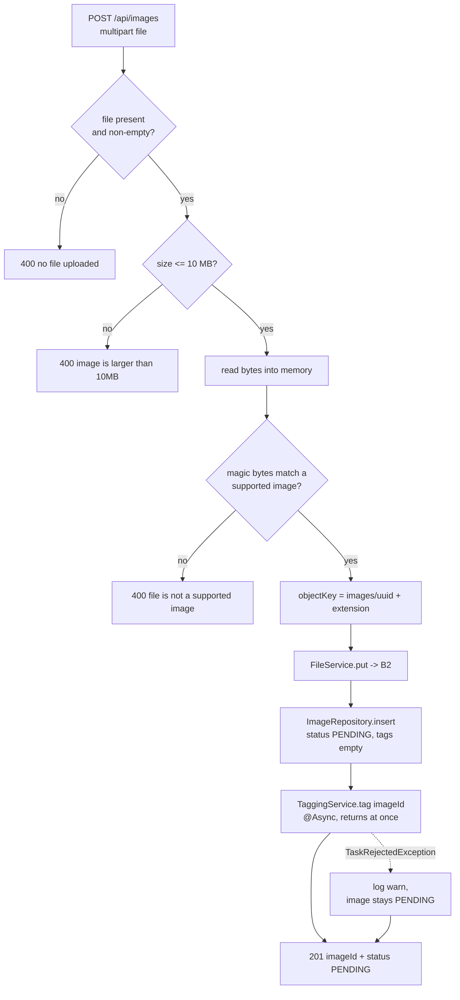
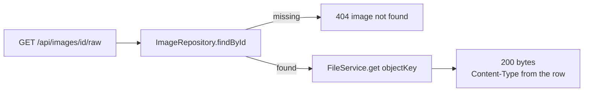

# Images

Everything about an uploaded image except the AI part: how bytes are validated,
where they are stored, how they are served back, and what listing, searching and
deleting do. The tagging that turns a `PENDING` row into a `DONE` one is in
[tagging.md](tagging.md).

- **Package:** `image` (`controller`, `service`, `repository`, `model`, `dto`)
- **Key classes:**
  [`ImageController`](../src/main/java/hackyourfuture/net/imageservice/image/controller/ImageController.java),
  [`ImageService`](../src/main/java/hackyourfuture/net/imageservice/image/service/ImageService.java),
  [`FileService`](../src/main/java/hackyourfuture/net/imageservice/image/service/FileService.java),
  [`ImageRepository`](../src/main/java/hackyourfuture/net/imageservice/image/repository/ImageRepository.java)

## The split: bytes in B2, metadata in Postgres

An image is two things stored in two places. The bytes go to a private
Backblaze B2 bucket under a random key; the row in `images` holds the owner, the
key, the content type, the status and the tags. Nothing binary ever enters the
database.

That keeps the database small and cheap to back up, and it means the thing that
grows without bound (image data) sits in object storage priced for exactly that.
The cost is that the two can drift — a successful `put` followed by a failed
`INSERT` leaves an orphan object in the bucket. Given that an orphan costs a
fraction of a cent and nothing user-visible, the app does not attempt a
distributed transaction or compensating delete.

## Upload



### Validation by magic bytes

The declared `Content-Type` on a multipart part is supplied by the client and
means nothing. `ImageService.detectContentType` ignores it and reads the first
bytes of the file instead:

| Type | Signature |
| --- | --- |
| JPEG | `FF D8 FF` |
| PNG | `89 50 4E 47` |
| GIF | `47 49 46 38` (`GIF8`) |
| WebP | `52 49 46 46` (`RIFF`) + `WEBP` at offset 8 |
| BMP | `42 4D` (`BM`) |

Anything else is a `400`. The detected type — not the declared one — is what
gets stored, sent to B2, handed to Gemini, and later returned by the raw
endpoint. So a `.jpg` that is really a ZIP is rejected, and a mislabelled but
genuine PNG is stored correctly as `image/png`.

This is a whitelist, and it is the format list Gemini accepts as inline image
data. Adding a format means adding its signature here and confirming the model
can read it.

### Size limits, twice

Two limits guard the upload, and they are deliberately not equal:

- `spring.servlet.multipart.max-file-size: 11MB` — Tomcat rejects the request
  before the app sees it, so a 200 MB body is not buffered.
- `MAX_BYTES = 10 MB` in `ImageService` — the app's own rule.

The framework limit sits *above* the application limit so that a 10.5 MB upload
reaches `ImageService` and gets the clear message `image is larger than 10MB`
rather than a generic container error. Anything above 11 MB throws
`MaxUploadSizeExceededException`, which `GlobalExceptionHandler` maps to the
same `400` and the same message — so the client sees one consistent answer
either way.

Bytes are read fully into memory (`file.getBytes()`). At 10 MB a piece with a
bounded number of upload threads, that is a deliberate simplification: it makes
magic-byte checking, the B2 `put` and the later Gemini call all trivial. A
streaming upload path would be the change to make if the limit ever rose
substantially.

### Object keys

```
images/9f1c4e0a-....-b1d2.jpg
```

A random UUID plus the extension for the detected type. Random, because the key
must not be guessable — the bucket is private, but keys leaking into logs or
error messages should still reveal nothing. Not the original filename, because
user-supplied names bring path traversal, encoding issues and collisions for no
benefit. The extension is cosmetic: it makes objects readable when browsing the
bucket in the B2 console, while the authoritative content type stays in the
database column.

## Storage: `FileService`

A thin wrapper over the AWS S3 SDK v2 pointed at B2's S3-compatible endpoint —
`put`, `get`, `delete`, nothing else. Two configuration details matter:

- **`forcePathStyle(true)`** — B2 serves `endpoint/bucket/key`, not the
  virtual-host style (`bucket.endpoint/key`) the SDK defaults to.
- **Static credentials** from `app.b2.*`, so no ambient AWS credential chain is
  ever consulted.

If the bucket or either key is blank, the client is **never built** and every
storage call throws `503 image storage is not configured`. That is why the app
boots without B2: auth, the frontend, the gallery and Swagger UI all keep
working, and only the routes that genuinely need bytes fail — with a status that
says exactly why. A hard failure at startup would make an incomplete `.env` look
like a broken build.

## Serving: the raw proxy



The bucket is private and stays private. Every read goes through this endpoint,
which is public — no session needed, because the gallery is public.

The alternative would be presigned URLs. Proxying was chosen because it keeps
image URLs stable and permanent (`/api/images/12/raw` never expires and can be
cached, bookmarked or embedded), keeps the bucket entirely invisible to clients,
and makes deletion effective immediately rather than after the last signed URL
lapses. The cost is that image bytes flow through the application process; at
this scale that is fine, and putting a CDN in front of the endpoint is the
escape hatch if it stops being fine.

## Listing, search and delete

| Operation | Query | Notes |
| --- | --- | --- |
| `listMine` | `WHERE user_id = ? ORDER BY created_at DESC, image_id DESC` | Uses `idx_images_user_id`. Uncapped |
| `listRecent` | `ORDER BY created_at DESC, image_id DESC LIMIT 50` | The gallery |
| `searchByTag` | `tags @> ? OR tags @> ? OR tags @> ?`, `LIMIT 50` | One containment probe per category; GIN-indexed |
| `findById` / `deleteById` | by primary key | |

Every ordering is `created_at DESC, image_id DESC`. The id tiebreaker is not
decoration: `created_at` defaults to `now()`, and two uploads inside the same
transaction timestamp would otherwise come back in an arbitrary order that could
change between requests.

Search lowercases and trims the term before probing, because the model is
instructed to emit lowercase tags — so the comparison is case-insensitive in
practice without a functional index. A blank query short-circuits to an empty
list rather than hitting the database.

**Delete** reads the row first, so it can distinguish the two failure modes
honestly: `404` when no such image exists, `403` when it exists but belongs to
someone else. The B2 object is removed before the row, so a failure midway
leaves an orphan object rather than a row pointing at bytes that are gone —
missing metadata is worse than a stray file.

Deletes also happen implicitly: `images.user_id` is `ON DELETE CASCADE`, so
removing a user removes their rows. The B2 objects are *not* cascaded, which is
a known gap — there is no user-deletion endpoint today, so nothing exercises it
yet.

## Model types

| Record | Purpose |
| --- | --- |
| [`Image`](../src/main/java/hackyourfuture/net/imageservice/image/model/Image.java) | The full row: id, owner, object key, content type, status, tags, timestamp |
| [`Tags`](../src/main/java/hackyourfuture/net/imageservice/image/model/Tags.java) | The three arrays, with `Tags.empty()` for "not tagged yet" |
| [`RawImage`](../src/main/java/hackyourfuture/net/imageservice/image/model/RawImage.java) | Bytes + content type, so the controller needs one call to serve a file |
| [`ImageResponse`](../src/main/java/hackyourfuture/net/imageservice/image/dto/ImageResponse.java) | The wire shape; `from()` builds the `url` |
| [`UploadResponse`](../src/main/java/hackyourfuture/net/imageservice/image/dto/UploadResponse.java) | Just `imageId` + `status` |

`Image` carries `userId` and `objectKey`; `ImageResponse` does not. The
ownership and storage details never leave the server — clients get an id, a
status, tags and a URL, which is everything the UI needs and nothing more.
