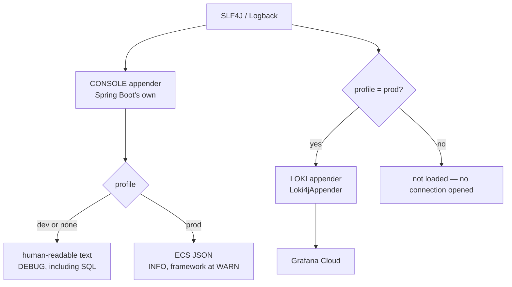

# Observability

Logging is the whole of it — there are no metrics, traces or health dashboards
today. The design goal is that production logs are queryable by a machine
without making local development unpleasant for a human.

- **Config:** [`logback-spring.xml`](../src/main/resources/logback-spring.xml)
- **Levels:** [`application-dev.yaml`](../src/main/resources/application-dev.yaml),
  [`application-prod.yaml`](../src/main/resources/application-prod.yaml)

## Two audiences, one configuration



The console appender is Spring Boot's own (`console-appender.xml`), included
rather than redefined. That is what lets `logging.structured.format.console` and
the per-package levels in the profile YAMLs keep working — nothing in
`logback-spring.xml` overrides day-to-day console behaviour.

## Development

`SPRING_PROFILES_ACTIVE=dev` turns on `DEBUG` at the root, plus `DEBUG` on
`org.springframework.jdbc.core` specifically — so every SQL statement
`JdbcClient` executes appears in the console with its parameters. For an app
whose data layer is hand-written SQL, that is the single most useful thing to
see while building a feature.

With no profile active you get `INFO` and plain text. Nothing ships anywhere.

## Production

The `prod` profile switches the console to **ECS JSON**
(`logging.structured.format.console: ecs`). Once Loki and Grafana are reading
the logs rather than a person at a terminal, structured fields beat prose: the
timestamp, level, logger, thread and message all become queryable fields instead
of substrings.

Levels are `INFO` at the root, with `org.springframework.web` and
`org.apache.catalina` at `WARN` — framework request noise at `DEBUG` costs real
money once every line is shipped and stored.

### Shipping to Loki

The `Loki4jAppender` lives inside `<springProfile name="prod">`, so dev, tests
and CI never load it and never open a network connection to Grafana. That is
deliberate: a test suite should not depend on an external service being
reachable, and a developer without Grafana credentials should see no errors from
a logging appender.

```xml
<labels>
    app = image-service
    level = %level
</labels>
<structuredMetadata>
    logger = %logger
    thread = %thread
</structuredMetadata>
```

**Labels versus structured metadata** is the one decision that matters here.
Loki indexes labels, and every distinct combination of label values creates a
separate stream — so high-cardinality labels are the classic way to make a Loki
instance expensive and slow. `app` has one value and `level` has five, which
keeps the stream count trivial while still allowing `level` to be filtered and
counted directly in a query.

`logger` and `thread` are useful but high-cardinality, so they go in structured
metadata: attached to each line and searchable, but not indexed as streams.

`thread` is worth having because of the `tagging-` thread-name prefix — it is
what makes background tagging work immediately distinguishable from `http-nio-`
request threads in a mixed log.

The batch size is capped at 64 KB because that is Grafana Cloud's per-push
limit, and the HTTP timeout is 15 s. Every connection detail
(`LOKI_URL`, `LOKI_USERNAME`, `LOKI_API_TOKEN`) is an environment variable — no
credential is committed.

If Loki is unreachable the appender drops logs. Nothing user-facing breaks, and
the console output is unaffected.

## Useful queries

```logql
# everything from the app
{app="image-service"}

# errors only
{app="image-service", level="ERROR"}

# error rate over 5-minute windows — the reason `level` is a label
count_over_time({app="image-service", level="ERROR"}[5m])

# background tagging only, via structured metadata
{app="image-service"} | thread =~ "tagging-.*"

# tagging failures, with the image id in the message
{app="image-service"} |= "tagging failed for image"

# uploads that arrived faster than the queue could drain
{app="image-service"} |= "tagging queue is full"
```

## What the app logs on purpose

Most log output is the framework's. The application itself logs deliberately in
three places, and each one marks a state the metrics would otherwise not reveal:

| Message | Level | Source | Means |
| --- | --- | --- | --- |
| `tagging queue is full, image {} left PENDING` | `WARN` | `ImageService` | The upload succeeded but was never queued — that image will stay `PENDING` forever |
| `tagging failed for image {}: {}` | `WARN` | `TaggingService` | Gemini call or B2 read failed; the row is now `FAILED` |
| `uncaught exception in async {}` | `ERROR` | `AsyncConfig` | The backstop fired — `TaggingService` handles its own errors, so this means something unexpected escaped |

The first two are `WARN` rather than `ERROR` because neither is a fault in the
service: one is backpressure, the other is an upstream failure the app handled
by design. The third is `ERROR` because it should never happen.

Nothing logs email addresses, session ids, passwords or image bytes.

## Gaps

Honest list of what is not here:

- **No metrics.** Spring Boot Actuator is not on the classpath, so there is no
  `/actuator/health` for Render to probe and no Micrometer counters. Upload
  volume, tagging latency and failure rate are all inferred from log lines
  today.
- **No tracing.** A single process with one async hop means correlation is
  currently "find the image id in the message" — the id is in both the upload
  log and the tagging log, which is enough at this size but is not a trace.
- **No alerting.** The LogQL error-rate query above is written for a Grafana
  alert rule; nothing configures one.
- **No request logging.** Access logs are off, so per-endpoint traffic is not
  visible.

Actuator plus a Micrometer counter on the tagging outcomes is the first thing to
add if this ever needs to be operated rather than demonstrated.
