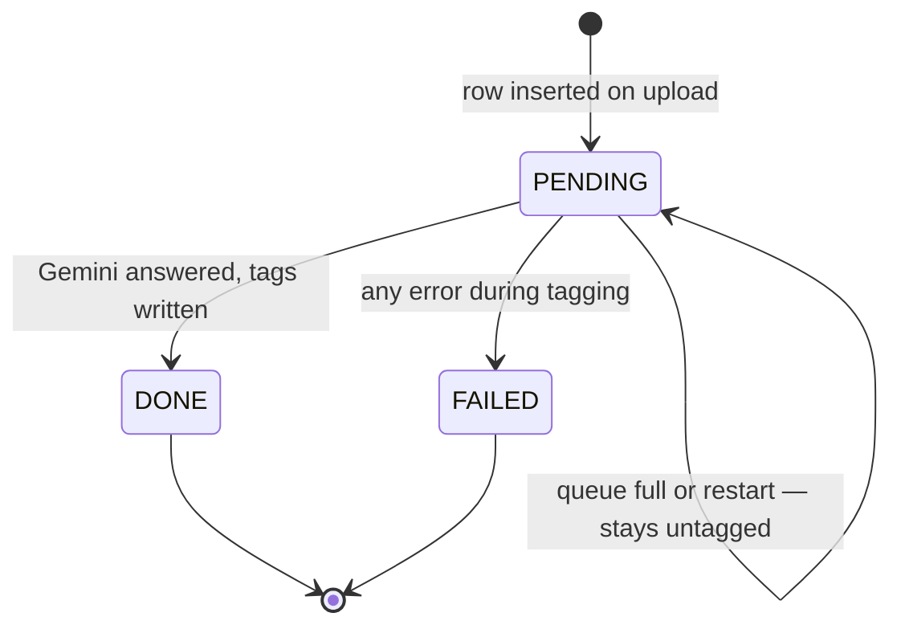
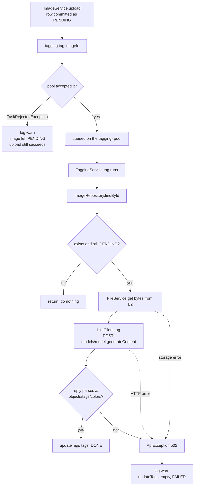

# AI tagging

Every uploaded image is described by a vision model into three arrays —
`objects`, `tags`, `colors` — which become the searchable index for the whole
app. The work is slow and failure-prone, so it happens on a background thread
and its outcome is exposed as a status the client can watch.

- **Package:** `tagging` (`service`, `client`)
- **Key classes:**
  [`TaggingService`](../src/main/java/hackyourfuture/net/imageservice/tagging/service/TaggingService.java),
  [`LlmClient`](../src/main/java/hackyourfuture/net/imageservice/tagging/client/LlmClient.java),
  [`AsyncConfig`](../src/main/java/hackyourfuture/net/imageservice/config/AsyncConfig.java)
- **Model:** Google Gemini, `gemini-flash-latest` by default

## Why it is asynchronous

A Gemini call takes seconds. Doing it inside the upload request would mean:

- the user watches a spinner for the length of an external API call;
- an HTTP request thread is parked on someone else's latency;
- a Gemini outage turns into an *upload* outage, even though the bytes are safe.

None of the upload's own work depends on the tags. So `ImageService` stores the
bytes, commits a `PENDING` row, hands the image id to the pool, and returns
`201` immediately. The tags arrive later, and the status column is how everyone
finds out.

## Lifecycle



| Status | Meaning | Tags |
| --- | --- | --- |
| `PENDING` | Stored, not yet tagged | Empty |
| `DONE` | Gemini answered and the tags were saved | Populated |
| `FAILED` | Tagging threw — bad key, rate limit, unparseable reply | Empty |

`FAILED` is a terminal state with no automatic retry. The image is otherwise
completely normal: stored, listed, served, deletable. It simply will not appear
in tag search.

## The flow



### The `PENDING` re-check

`tag()` reloads the image and does nothing unless it is still `PENDING`. That
makes a duplicate submission a no-op instead of a second Gemini call, and it
means the method is safe to invoke again from anywhere — a future retry job, an
admin re-tag endpoint — without any coordination.

### Failure handling

`TaggingService` catches `RuntimeException` around the whole body and writes
`FAILED` with empty tags. The alternatives were worse: leaving the row `PENDING`
would make the frontend poll forever, and letting the exception escape would
lose it entirely, since an `@Async void` method has no caller left to catch it.

`AsyncConfig` still registers an `AsyncUncaughtExceptionHandler` as a backstop.
`TaggingService` handles its own errors, so that handler firing means something
unexpected got out — for example, the `updateTags` write in the catch block
itself failing.

## The thread pool

The pool is Spring Boot's own `applicationTaskExecutor`, enabled by `@EnableAsync`
in `AsyncConfig` and sized in
[`application.yaml`](../src/main/resources/application.yaml):

```yaml
spring:
  task:
    execution:
      pool:
        core-size: 2
        max-size: 4
        queue-capacity: 100
      thread-name-prefix: tagging-
      shutdown:
        await-termination: true
        await-termination-period: 30s
```

Keeping the numbers in YAML rather than in a `@Bean` means they can be tuned per
environment without a code change.

**`core-size: 2` is the real concurrency limit.** A `ThreadPoolExecutor` only
grows toward `max-size` once the queue is full — with a 100-deep queue, threads
3 and 4 essentially never appear. Two is right because the constraint is
Gemini's rate limit, not CPU: each task is one HTTPS call that spends its life
waiting. Raising this is how you go faster, and the ceiling is whatever quota
the API key has.

**`queue-capacity: 100`** absorbs bursts. If it fills, `tag()` throws
`TaskRejectedException`, which `ImageService.requestTagging` catches and logs:

```java
catch (TaskRejectedException e) {
    log.warn("tagging queue is full, image {} left PENDING", imageId);
}
```

The upload has already stored the bytes and committed the row at that point.
Turning a saturated queue into a `500` would fail a request that actually
succeeded. Leaving the image `PENDING` and untagged is the honest outcome.

**`await-termination: 30s`** lets in-flight tagging finish on shutdown instead
of stranding rows mid-flight. The queue itself is in memory, so anything still
waiting when the process stops is lost and its images stay `PENDING` forever.
There is no sweeper today; a scheduled "re-tag anything `PENDING` and older than
N minutes" job would close that gap, and the `PENDING` re-check above already
makes such a job safe to run.

The `tagging-` thread prefix is what makes this visible in logs — tagging work
is immediately distinguishable from `http-nio-` request threads.

## The Gemini call

`LlmClient` builds one `generateContent` request per image using Spring's
`RestClient`. The API key travels in the `x-goog-api-key` header, set once as a
default header when the client is constructed.

The request body carries the image inline plus the prompt:

```json
{
  "contents": [{ "parts": [
      { "inline_data": { "mime_type": "image/jpeg", "data": "<base64>" } },
      { "text": "<the prompt>" }
  ]}],
  "generationConfig": {
    "responseMimeType": "application/json",
    "responseSchema": { "type": "OBJECT", "properties": { … }, "required": ["objects","tags","colors"] }
  }
}
```

Jackson base64-encodes the `byte[]` automatically, and `@JsonInclude(NON_NULL)`
on the request records drops the unused half of each `Part` — Gemini rejects a
part carrying both `text` and `inline_data`.

### Forcing the shape

`responseMimeType: application/json` plus an explicit `responseSchema` is what
makes this reliable. Without it the model returns prose, or JSON wrapped in a
markdown fence, and the client ends up doing string surgery to find the object.
With it, the reply is a JSON object with exactly `objects`, `tags` and `colors`,
all three required — so `json.readValue(text, Tags.class)` is the entire parsing
step.

Anything that still does not parse becomes `502 could not parse tags from the
LLM reply`, and an empty or malformed candidate list becomes `502 the LLM
returned no tags`. Both are caught upstream and recorded as `FAILED`; because
tagging is asynchronous, no client ever sees a `502` — it exists so the failure
is legible in the logs.

### The prompt

```
You are an image tagging assistant. Look at the image and return JSON with three arrays:
- "objects": concrete physical things visible in the image (e.g. tree, car, cloud, person).
- "tags": everything that is not a physical object — setting, time of day, weather, mood,
  style, activity, season.
- "colors": up to 3 of the most prominent colours, each chosen ONLY from this list of 11
  basic colours: red, orange, yellow, green, blue, purple, pink, brown, black, white, gray.
Use lowercase single words or short phrases. Do not invent things that are not visible.
```

Three constraints in it exist because of how search works:

- **Lowercase, single words or short phrases.** Search is exact-term containment
  against `jsonb`, so `Sunset` and `a beautiful sunset` would be unreachable
  terms. Consistency at write time is what makes the read side simple.
- **Colours from a fixed list of 11.** An unconstrained model produces
  `cerulean`, `off-white` and `warm beige` — all correct, all useless as a
  shared vocabulary. Eleven basic colours mean a search for `blue` actually
  finds the blue images.
- **"Do not invent things that are not visible."** Hallucinated tags are worse
  than missing ones: they poison other people's searches, not just the
  uploader's own listing.

The split between `objects` and `tags` keeps concrete nouns apart from mood,
setting and style. Search queries all three plus `colors` in one go, so the
distinction costs a user nothing while leaving room for a future faceted UI.

## Configuration

| Variable | Default | Effect |
| --- | --- | --- |
| `LLM_API_KEY` | *(empty)* | Google AI Studio key. Unset means every tagging attempt fails and images end `FAILED` |
| `GEMINI_MODEL` | `gemini-flash-latest` | An alias that tracks Google's current flash model |
| `GEMINI_BASE_URL` | `https://generativelanguage.googleapis.com/v1beta` | Override to point at a proxy or a mock in tests |

A missing key does not stop the app booting — uploads keep working and the
images simply never get tags. That mirrors the B2 behaviour described in
[images.md](images.md): degrade the feature, do not refuse to start.

`gemini-flash-latest` is an alias rather than a pinned version, chosen because
tag quality is not version-sensitive and the alias avoids chasing deprecations.
Pin it via `GEMINI_MODEL` if reproducibility ever matters more.

## Tests

[`TaggingAsyncTest`](../src/test/java/hackyourfuture/net/imageservice/tagging/TaggingAsyncTest.java)
asserts that `tag()` leaves the calling thread and runs on the configured pool.
It mocks `ImageRepository` so the first call inside `tag()` reveals which thread
the work landed on, then returns empty to stop the method there.

It is a small test guarding a silent failure: if `@Async`, `@EnableAsync` or the
proxying ever break, tagging quietly becomes synchronous and blocks every
upload. Nothing else in the suite would notice — every assertion would still
pass, just slower.
